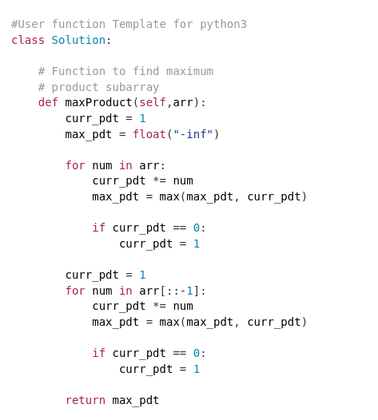
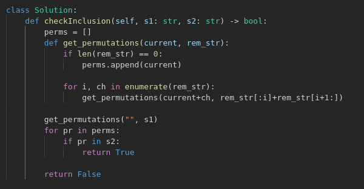

# Revisit
### Graph
- [Detect cycle in undirected graph](https://www.geeksforgeeks.org/problems/detect-cycle-in-an-undirected-graph/1?itm_source=geeksforgeeks&itm_medium=article&itm_campaign=practice_card)
- [42. Trapping Rain Water](https://leetcode.com/problems/trapping-rain-water)
- [15. 3Sum](https://leetcode.com/problems/3sum/description)
- [31. Next Permutation](https://leetcode.com/problems/next-permutation/description)
- [48. Rotate Image](https://leetcode.com/problems/rotate-image/submissions/1439548326)
  hint: transpose + reverse
- [49. Group Anagrams](https://leetcode.com/problems/group-anagrams/submissions/1440056199)
  hint: without sorting -> take `arr = [0] * 26`, for every character, `arr[ord(ch) - ord('a')] += 1`. This will sort each woord. Use `str(arr)` as key.
- [1329. Sort the Matrix Diagonally](https://leetcode.com/problems/sort-the-matrix-diagonally/description)
  hint: 
- [724. Find Pivot Index](https://leetcode.com/problems/find-pivot-index/description/)
  hint: although this looks like a two pointer, but we should use two pointer primarily when we intend to reduct the range or we can find definite answe with the two pointers. In this case use cumulitive/prefix sum.
- [36. Valid Sudoku](https://leetcode.com/problems/valid-sudoku/description/)
  hint: 
  in order to group `n*n` block in a 2D matrix, divide rows by n and columns by n.
- [976. Largest Perimeter Triangle](https://leetcode.com/problems/largest-perimeter-triangle/description/)
  hint: in oorder to find largest perimeter of a triangle, we can sort it and start from last. if the last (greatest) 3 number don't follow `side1 + side2 > side3`, `side2 + side3 > side1` and `side3 + side1 > side2` then omit greatest and check next 3 greatest numbers. Because if side[n], side[n-1] and side[n-2] can't form tringle then it means `side[n-1] + side[n-2] < side[n]`. So ideally we can only check if `side[n-1] + side[n-2] > side[n]` we can return their sum.
- [645. Set Mismatch](https://leetcode.com/problems/set-mismatch/description)
  hint: whenever input is an array with elements 1-n where n is size of array, this is a hint that we can use element value to go to an index by doing `arr[arr[i] - 1]`. Here we can first traverse the array and for each i set `arr[arr[i] - 1] = - arr[arr[i] - 1]` if `arr[arr[i] - 1] > 0`, but if the value is negative then we have already visited this index, and arr[i] is the duplicate. We can traverse the array one last time to find the only postive number in the array. the missing number is index of the only positive number + 1. 
- [523. Continuous Subarray Sum](https://leetcode.com/problems/continuous-subarray-sum/description/)
  hint: we cannnot use sliding window here because we don't know how to reduce the window size. So we will use a math property if num % k = x, the (num + multiple of k) % k = x, e.g., 31 % 4 = 3, (31 + 12) = 43, 43 % 4 = 3.
   
- [Stock Buy and Sell – Multiple Transaction Allowed](https://www.geeksforgeeks.org/batch/gfg-160-problems/track/arrays-gfg-160/problem/stock-buy-and-sell2615)
  hint: because there is a dependency such that we can buy after we sell, i.e., when we loop through the loop, after we see a small number, we cannot pair it with a large number that has come before, we can only pair it with a large number in the future. So what we should do is, as soon as we encounter a small number, we should reset the large number as well. This ensures that we only look forward and not behind.
  
- [Stock Buy and Sell – Max one Transaction Allowed](https://www.geeksforgeeks.org/batch/gfg-160-problems/track/arrays-gfg-160/problem/buy-stock-2)
  hint: becuse we can only look forward, instead of using a window (we cannot use a window because we have no way of reducing it), we can use double pointers that move from left to right, one pointer to mark sell and one to mark buy. Since we cannot sell before buy, i.e., we cannot pair current low value with any large value previously seen, we have to reset the sell pointer everytime we move the buy pointer.
  
- [Kadane's Algorithm](https://www.geeksforgeeks.org/batch/gfg-160-problems/track/arrays-gfg-160/problem/kadanes-algorithm-1587115620)
  hint: for max subarray we are more interested in max sum produced by +ve numbers.
  [Video Reference](https://www.youtube.com/watch?v=AHZpyENo7k4)
- [Maximum Product Subarray](https://www.geeksforgeeks.org/batch/gfg-160-problems/track/arrays-gfg-160/problem/maximum-product-subarray3604)
  hint: this can be solved with slight modification to kadane's algorithm. All we need to do is do a forward pass and the a backward pass. This helps eliminate odd number of -ve numbers.
  
  [Video Reference](https://www.youtube.com/watch?v=hnswaLJvr6g)
- [990. Satisfiability of Equality Equations](https://leetcode.com/problems/satisfiability-of-equality-equations/description/)
  hint: create graph by connecting all nodes with "==". Then, for each "a!=b", check if we can reach "b" from "a" by graph traversal. If we can then there is contradiction.
- [Max Circular Subarray Sum](https://www.geeksforgeeks.org/batch/gfg-160-problems/track/arrays-gfg-160/problem/max-circular-subarray-sum-1587115620)
  hint - [Video Reference](https://www.youtube.com/watch?v=Za8V4wkZKkM)
- [210. Course Schedule II](https://leetcode.com/problems/course-schedule-ii/description/)
- [207. Course Schedule](https://leetcode.com/problems/course-schedule/)
- [1129. Shortest Path with Alternating Colors](https://leetcode.com/problems/shortest-path-with-alternating-colors/description/)
  hint: with bfs, if path count is needed, most of the time path count should be added to queue along with neighbour nodes. Plus if graph is bi-directional with different weights along different directions, then for visited set, we also need to add in this format `f"{nei}_{nei_edge}"` because if we just chech `if nei in visited: continue` then we don't take into account this neighbor revisiting through a different edge. Check submitted solution.
- [1319. Number of Operations to Make Network Connected](https://leetcode.com/problems/number-of-operations-to-make-network-connected/description/)
  hint: if this case we are not just checking cycle, we are counting the number of edges we have that makes a cycle (i.e., number of cycles), e.g., A<->B<->C<->A, here C<->A edge can be removed. To do this we need to cache C<->A edge as well, or else we can go through ths edge twice, once via A<->B<->C<->A and once via A<->C. So even if a node is already visited, we need to check if the same edge was used to form a previous cycle.
### Linked List
`Tip: if we need to maintain order like a list, but also be able to change order of elements inside the list in time O(1), instead of O(n), we should use linked list.`

```
Tip: If we are frequently inserting or deleting nodes at both ends (head/tail) or in the middle, it is almost always better to use dummy head and tail nodes. This will remove edge case checks like:
if node.next is not None and node.prev is not None:
  node.next.prev = node.prev.Next
```
- [237. Delete Node in a Linked List](https://leetcode.com/problems/delete-node-in-a-linked-list/description/)
  hint: in order to remove node we need prev node, but here there is no way of accessing prev node. So we will instead traverse the linked list till the end and replace current node value with next value and finally drop the last node.
- [142. Linked List Cycle II](https://leetcode.com/problems/linked-list-cycle-ii/description/)
  hint: [Video Reference](https://www.youtube.com/watch?v=vlrxs-LPni4&list=PLpIkg8OmuX-LH398-_ZcuHiRueOdsJbXU&index=5)
- [382. Linked List Random Node](https://leetcode.com/problems/linked-list-random-node/description)
  hint: consider linked list `[a, b, c, d, e, f]`. Prob of selecting a is 1. Then looking at prob of not changing (i.e., selecting) `a` between `a` and `b` is 1/2, then prob of not changing `a` between `a`, `b` and `c` is 2/3, next 3/4, .... n-2/n-1, n-1/n. So if we multiply all of them, the final prob of selecting is 1/n. Check submission.
- [109. Convert Sorted List to Binary Search Tree](https://leetcode.com/problems/convert-sorted-list-to-binary-search-tree/description/)
  hint: time complexity nlogn. Recursive divide and conquere (binary search). Recurssively find mid point, attach left and right. Check solution.
- [23. Merge k Sorted Lists](https://leetcode.com/problems/merge-k-sorted-lists/description/)
  hint: [Video Reference](https://www.youtube.com/watch?v=Q64u-W3l3mA&list=PLpIkg8OmuX-LH398-_ZcuHiRueOdsJbXU&index=8) time complexity klogn. My solution time complexity kn.
- [1171. Remove Zero Sum Consecutive Nodes from Linked List](https://leetcode.com/problems/remove-zero-sum-consecutive-nodes-from-linked-list/description/)
  hint: if we have to remove consecutive nodes which sum up to 0, then cumulative sum before and after the consecutive nodes should be the same. We can save the cumulative sum in a dict as key and corresponding node as value. While traversing through the linked list, if a cumulative sum is already present in our dict, then we found a consecutive section of nodes summing to 0. We can set the next of the node value of the dict entry to current node->next. We need to iterate through these consecutive nodes and remove their entries from the dict. Finally add a dummy head to the linked list to handle original head being part of the consecutive nodes summing up to 0. At the end we can return dummy node->next as output. [Video Reference](https://www.youtube.com/watch?v=5UWEVMg10rY&list=PLpIkg8OmuX-LH398-_ZcuHiRueOdsJbXU&index=9)
- [1721. Swapping Nodes in a Linked List](https://www.youtube.com/watch?v=TxryJMerDwE&list=PLpIkg8OmuX-LH398-_ZcuHiRueOdsJbXU&index=10)
  hint: If we need to find nth node from the last, in a single pass, we can move to nth item from the front, then immediately put a second pointer at head position and increment both of them till current pointer becomes null. Then the second pointer will point to nth node from the end. [Video Reference](https://www.youtube.com/watch?v=TxryJMerDwE&list=PLpIkg8OmuX-LH398-_ZcuHiRueOdsJbXU&index=10)
- [24. Swap Nodes in Pairs](https://leetcode.com/problems/swap-nodes-in-pairs/description/)
  hint: use recurssion for problems like this, flattening of linked list, flattening of doubly linked list. [Video Reference](https://www.youtube.com/watch?v=8yLiGS4ntHw&list=PLpIkg8OmuX-LH398-_ZcuHiRueOdsJbXU&index=11)
- [138. Copy List with Random Pointer](https://leetcode.com/problems/copy-list-with-random-pointer/description/)
  hint: approach 1 is to use two loops and a hashmap or array. first create new nodes with values of given linked list and store each node in an array or hashmap. In the second loop set value of next and randon pointer. [Reference Code](https://leetcode.com/problems/copy-list-with-random-pointer/solutions/6280241/video-solution-with-hashmap-python-javascript-java-c/). Approach 2 uses no extra space. [Video Reference](https://www.youtube.com/watch?v=q570bKdrnlw)
- [2. Add Two Numbers](https://leetcode.com/problems/add-two-numbers/description/)
  hint: at the end, do not forget to check if carry is greater than 0. If yes, then create another node with carry.
### String
- [567. Permutation in String](https://leetcode.com/problems/permutation-in-string/description/)
  hint: Approach 1 is to generate all permutations. Here is the code for that: 
But the better approach is to identify that permutations of all strings will have the same characters. So we can sort the string and all its permutations and the output should be the exact same. Say string s1 has length `n1` and s2 has length `n2`. So we can take string s2 and loop through all chunks of length [i, i+n1]. If this chunk is sorted and the output is the same as the sorted output of s1, then we can say that a permutation of s1 is present in s2. But sorting takes n1log(n1) time complexity. A better solution can be that we take a 26 length array and fill it with count of characters. E.g., let s1 = `"aab"`, we can represent it in as an array like this `[2, 1, 0, 0, .... ]` and if the chunk produces the same array, we can say that a permutation exists. [Leetcode Editorial Solution](https://leetcode.com/problems/permutation-in-string/editorial/)
- [290. Word Pattern](https://leetcode.com/problems/word-pattern/description/)
  hint: a very easy problem with a very easy trap to fall into. Lets take pattern `"abba"` and string `"dog dog dog dog"`, this should throw error. Check submission for solution. [Submission](https://leetcode.com/problems/word-pattern/submissions/1514890238/)
- [1071. Greatest Common Divisor of Strings](https://leetcode.com/problems/greatest-common-divisor-of-strings/description/)
  hint: [Solution](https://leetcode.com/problems/greatest-common-divisor-of-strings/solutions/3024822/greatest-common-divisor-of-strings/)
### Array
`Tip: If array has both +ve and -ve numbers, we cannot use sliding windoow. In such cases we need prefix sum with hash map`

`Tip: If order is important, we cannot use sorting`

`Note: sub-array is contiguous, sub sequence is non contiguous`

`Tip: A different way of doing sliding window is, hashing the prefix sum along with index as key-value in dict. Here, if we need to find sub-array that sum to value k, we can check if k - current_sum in dict. If yes, then dict[k-current_sum] to curren_index is the sub array. Check video: [Video Reference](https://www.youtube.com/watch?v=frf7qxiN2qU)`

`Tip: If sub array problem with sum, check prefix or prefix + hashing`

```
Tip: For prefix sum hash map problems, if array contains +ve and -ve numbers then:

1) Store {prefix_sum: count} in hash
2) Initialize the hash with {0: 1}
```

`Tip: If order is not important, ask yourself this question: If I sort this array, will it make my job easier?`
- [560. Subarray Sum Equals K](https://leetcode.com/problems/subarray-sum-equals-k/description/)
  hint: [video reference](https://www.youtube.com/watch?v=xvNwoz-ufXA)
- [56. Merge Intervals](https://leetcode.com/problems/merge-intervals/description/)
  hint: if we sort the array, then it becomes easier to merge the groups. Sort, then loop over all entries and check if current start <= prev end current end > previous end. If yes then merge. [Solution code](https://leetcode.com/problems/merge-intervals/submissions/1655509120/)
### Binary Tree
- [114. Flatten Binary Tree to Linked List](https://leetcode.com/problems/flatten-binary-tree-to-linked-list/description/)
  hint: [Solution](https://www.youtube.com/watch?v=sWf7k1x9XR4)
- [236. Lowest Common Ancestor of a Binary Tree](https://leetcode.com/problems/lowest-common-ancestor-of-a-binary-tree/description/)
  hint: [My Submission - easy to understand](https://leetcode.com/problems/lowest-common-ancestor-of-a-binary-tree/submissions/1656998875/), [Elegant Solution](https://leetcode.com/problems/lowest-common-ancestor-of-a-binary-tree/submissions/1657107800/)
